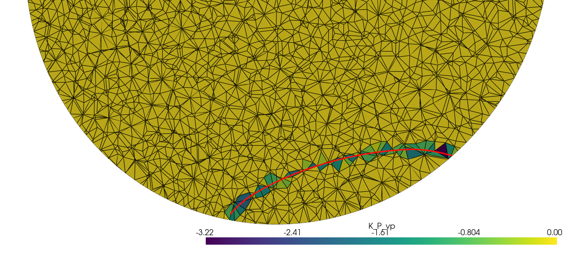

```markdown
# SensRay

Lightweight utilities for building planet (1D) models, generating meshes, computing per-cell ray path lengths and simple sensitivity kernels. SensRay intentionally provides a small, stable public API and delegates ray tracing to ObsPy/TauP and 3D rendering to PyVista.

## Highlights

- PlanetModel: load .nd TauP-style 1D models, inspect profiles, and build a TauPyModel when needed.
- PlanetMesh: generate octree or tetrahedral meshes from a PlanetModel, map properties onto mesh cells, compute per-cell ray lengths and sensitivity kernels, and visualize slices.
- CoordinateConverter: simple geographic/cartesian helpers used internally and available for convenience.

This README documents the current public surface of the package and quick examples. For detailed workflows see the notebooks in `demos/`.

## Installation

Install in editable/development mode (recommended for contributors):

```bash
pip install -e .
```

Optional extras for demos and development:

```bash
pip install -e "[dev,notebooks]"
```

Dependencies you will likely need for full functionality:

- obsPy (TauP) — ray calculation
- pyvista — mesh I/O & visualization
- discretize — octree mesh generation (optional for octree)
- pygmsh + meshio — tetrahedral mesh generation (optional)

Only core operations (PlanetModel parsing) work without these optional heavy deps.

## Quick API overview

Import the small public API:

```py
from sensray import PlanetModel, PlanetMesh, CoordinateConverter

# Load a standard model
model = PlanetModel.from_standard_models('prem')  # aliasing exists in code

# or load a custom .nd file
model = PlanetModel('path/to/model.nd')

# Create a mesh (either generate or load from file)
mesh = model.create_mesh(mesh_type='tetrahedral', mesh_size_km=200.0)

# Populate mesh with properties from the model
mesh.populate_properties(['vp', 'vs', 'rho'])

# Compute ray lengths from an ObsPy ray/arrival and store as cell data
# (ray is an ObsPy RayPath or Arrival with `.path` containing depth/lat/lon)
lengths = mesh.compute_ray_lengths_from_arrival(ray, store_as='P_ray_lengths')

# Compute a sensitivity kernel for property 'vp' and store as cell data
K = mesh.compute_sensitivity_kernel(ray, 'vp', attach_name='K_vp')

# Visualize a cross section colored by a cell-data property
plotter = mesh.plot_cross_section(property_name='K_vp')
plotter.show()
```

Notes on API behavior
- PlanetModel is read-only: it parses .nd files and provides get_property_at_depth/profile helpers and a lazy TauPyModel accessor.
- PlanetMesh supports octree and tetrahedral mesh generation. Tetrahedral generation requires `pygmsh` + `meshio` while octree generation requires `discretize`.
- Ray length calculation expects ObsPy ray objects (with a `.path` attribute) or arrival objects; the methods accept several path representations for convenience.
- Sensitivity kernel formula implemented: K = -L / (prop^2 + eps). See `PlanetMesh.compute_sensitivity_kernel` for details.

## Demos

See the notebooks in `demos/` for runnable examples:

- `01_basic_usage.ipynb` — load models, create tetrahedral mesh, populate properties, save/load mesh
- `02_ray_tracing_kernels.ipynb` — trace rays using ObsPy/TauP, compute/stash per-cell ray lengths, compute sensitivity kernels, and visualize results

Pre-generated demo meshes are present as VTU files in `demos/` for quick testing (e.g. `prem_tet_demo.vtu`, `prem_tet_rays_kernels_demo.vtu`).

## Recommended workflow

1. Create or load a PlanetModel: `PlanetModel.from_standard_model('prem')` or `PlanetModel('file.nd')`.
2. Generate a mesh: `model.create_mesh(mesh_type='tetrahedral', mesh_size_km=200.0)`.
3. Populate properties and optionally save mesh: `mesh.populate_properties(['vp','vs'])`, `mesh.save('my_mesh')`.
4. Compute ray paths with ObsPy/TauP (not provided by this package) and use `mesh.compute_ray_lengths_from_arrival(...)` to map the ray into cell lengths.
5. Compute sensitivity kernels with `mesh.compute_sensitivity_kernel(...)` or batch with `compute_sensitivity_kernels_for_rays(...)`.

## Notes for contributors

- Keep the public API small: the package intentionally exposes only `PlanetModel`, `PlanetMesh` and `CoordinateConverter`.
- Heavy dependencies (pyvista, discretize, pygmsh) are optional and should be imported lazily where possible. Unit tests should skip features requiring optional heavy deps when not available.

## Troubleshooting & tips

- If `PlanetMesh` raises import errors, install the optional visualization/mesh dependencies: `pip install pyvista discretize pygmsh meshio`.
- For large images generated by demos, keep PNG widths around 800–1200px to render nicely in the README.

## License

MIT

```
# SensRay

A convenience Python package for computing and visualizing ray theoretical sensitivity kernels based on a 1D background model. The core functionality for ray tracing and visualization is basically a wrapper of Obspy.Taup with some extra convenience methods.

## Overview

SensRay provides modern tools for seismic ray path analysis and Earth model studies:

- **Travel Time Calculations**: Based on Obspy.taup.
- **Ray Path Tracing**: Based on Obspy.taup
- **Earth Model Comparison**: For now it only deals with the three models available in Obspy.taup, but I will add the option to use custom models, including for other planets/satelites.
- **2D Visualization**: Circular Earth cross-sections with ray plotting. It uses the ray information from Obspy.taup but then the plotting is done separately to add more custom features that are not available in the minimalist plotting of Obspy.
- **3D Visualization**: This uses the geographic ray tracing of Obspy.taup to get ray paths in geographic coordinates and plots them in an interactive 3D Earth.

## Installation

```bash
pip install -e .
```

For development:
```bash
pip install -e ".[dev,notebooks]"
```

## Quick Start

```python
from sensray import TravelTimeCalculator, RayPathTracer, EarthPlotter
import matplotlib.pyplot as plt

# Calculate travel times for different phases
calc = TravelTimeCalculator('iasp91')
arrivals = calc.calculate_travel_times(
    source_depth=10,  # km
    distance=60       # degrees
)

print(f"Found {len(arrivals)} seismic phases")
for arrival in arrivals:
    print(f"{arrival.name}: {arrival.time:.1f} seconds")

# Extract and visualize ray paths
tracer = RayPathTracer('prem')
ray_paths, info = tracer.get_ray_paths(
    source_depth=10,
    distance_deg=60,
    phases=['P', 'S', 'PP']
)

# Create publication-quality 2D visualization
plotter = EarthPlotter()
ray_coordinates = tracer.extract_ray_coordinates(ray_paths)

fig = plotter.plot_circular_earth(
    ray_coordinates=ray_coordinates,
    source_depth=10,
    distance_deg=60,
    fig_size=(10, 10)
)
plt.show()
```

## Demos

Explore the package capabilities through concise interactive Jupyter notebooks (found in `demos/`):

- **[01_basic_usage.ipynb](demos/01_basic_usage.ipynb)** — basic usage: load a 1D Earth model, create a tetrahedral mesh, populate simple properties and visualize them.
- **[02_ray_tracing_kernels.ipynb](demos/02_ray_tracing_kernels.ipynb)** — ray tracing and sensitivity kernels: compute per-cell ray lengths and sensitivity kernels, visualize and save results.

There are also pre-generated demo mesh files in `demos/` (VTU + metadata): `prem_tet_demo.vtu`, `prem_tet_rays_kernels_demo.vtu`.

Run the demos locally with Jupyter, for example:

```
jupyter notebook demos/01_basic_usage.ipynb
```

<p align="center">
    
</p>

## Core Modules

- **core.travel_times**: Travel time calculation with multiple Earth models
- **core.ray_paths**: Ray path extraction with geographic coordinate support
- **core.earth_models**: Earth model management and 1D profile visualization
- **visualization.earth_plots**: Circular Earth cross-sections and ray plotting
- **visualization.earth_3d**: Interactive 3D visualization with PyVista
- **kernels.sensitivity**: NOT DONE!
- **kernels.sensitivity**: Basic sensitivity-kernel helpers are implemented on `PlanetMesh` (see `demos/02_ray_tracing_kernels.ipynb`).

What's new
-- Tetrahedral-only demo notebooks and mesh export (no octree examples in demos).
-- Per-ray and multi-ray sensitivity kernel computation implemented and exposed on `PlanetMesh`.

## Dependencies

- NumPy, SciPy, Matplotlib
- **PyVista**: For 3D interactive visualization
- **ObsPy**: For seismic data processing and ray calculations
- **Cartopy**: For geographic data (optional)

## License

MIT License
